#+title: 3D Modelling in Freecad using Rust and A.I.
#+SETUPFILE: ../org-html-themes/org/theme-readtheorg.setup

I took a break developing [[https://github.com/pramatias/snippet-agent][snippet-agent]] for 3 months, and started experimenting with A.I. for automating 3D modeling. Just as was starting out, I watched the [[https://www.youtube.com/watch?v=rWZRh2RXf14][titans of machining]] selling A.I. software to modify in bulk thousands of little faces and edges that spawn up in 3D models, a common problem that one.

The last time I 3D modeled was more than 10 years ago, for a week, but I quickly got tired of using the mouse non stop. The general idea is that people who use the mouse to complete tasks, or buttons for that matter, do not know much about computers. The titans of machining look exactly like the guys who use the mouse to accomplish tasks, and they push buttons a lot.

The question that popped in my mind occasionally was, *how long till manipulating 3D geometry with code becomes possible?* I think we are here, and it is not crazy good, just yet.

Below is a list of examples I generated, by instructing Gemini to recognize shapes and objects in a random picture of something, taking that textual description, feeding it to Claude and generating the Rust and Python code for Freecad.

All the examples except Roy, were completed in that way, sometimes Claude one-shotted the solution, almost correctly. The code usually runs effortessly, but the orientation or absolute position of some elements is slightly off. Sometimes I corrected that by retrying one or two times and that's about it. I adjusted the textual description spitted out by Gemini minimally, one or two lines.

None the examples below was given additional care by me, I am a total noob in Freecad and oh boy, Freecad is pretty complicated. I didn't change much of the Claude code either, but after some tries, I found a code setup that is clear and it helps Claude to write and manipulate the 3D geometry calculations.

I always generated one example of a 3D modelling scene, and gave that code as an example for the next scene. Also the geometry related code has some room for improvement, the better this is expressed even in one example, the next example is generated better. Claude likes good code as much as the next person and it performs better when a human mind has also worked on the problem.

Roy is a 3D Inventory Management Tool for a supermarket with multiple floors, a prototype of the usual CRUD app, with a database holding all the objects and their geometry. It has an admin tool called cli, and additional information can be found in the [[https://github.com/pramatias/freecad-experiments][repo]] .

Roy loads thousands of product data for the whole supermarket, it takes forever to start(more than 10 mins), but when everything is rendered, small changes modify only what has changed (from the cli admin tool). Which means that every product modification by the admin, loads in milliseconds. Freecad doesn't refresh automatically of course. Python reads the whole scene, passes everything to Rust, it is compared with what already exists in the database, and the Python macro is informed by Rust, to change that one thing only (or more).

Roy's functionality was not one shotted by Claude (of course), it was pretty difficult to get it correct, but after some testing, I haven't spotted any more bugs to fix. I did lot's of refactoring and the code is of pretty good quality I assume.

So here they are, all of the examples apart from the first, were almost one-two-three-shotted with minimal involvement by me. I could specify better geometry myself instead of Gemini, but I didn't bother to.

* Roy
A supermarket building from the outside
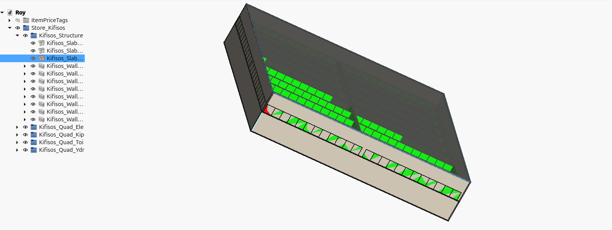

All products inside, color tagged
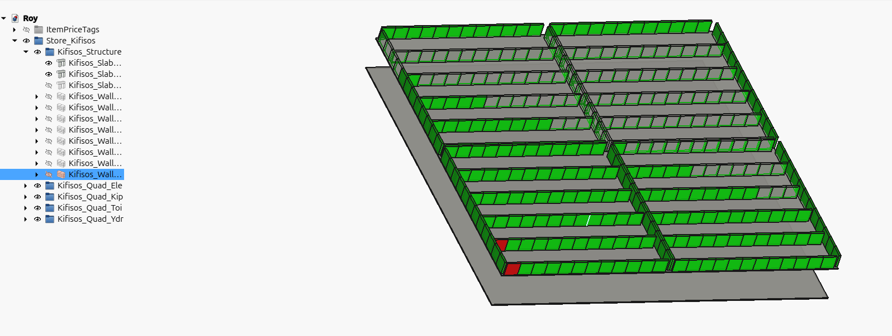

Changing the color of just one product, (Freecad for some reason doesn't colorize all products, it colorizes only half, and that half is different every time, but the uncolorized products are always half, always)
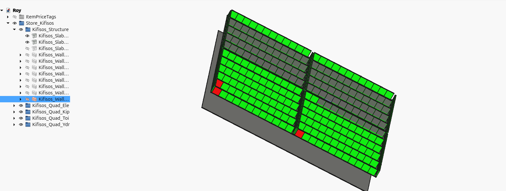

[[https://github.com/pramatias/freecad-experiments/tree/main/roy][code]]
* Iris
Photo of a random album cover, just a strange eye cropped out

3D generation
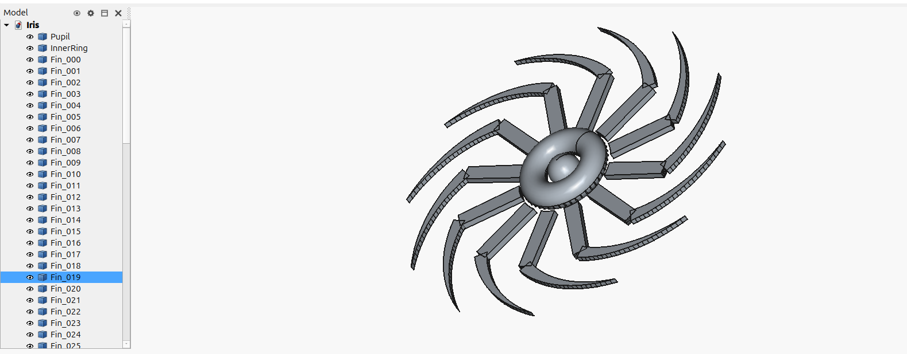

Hiding some 3D elements
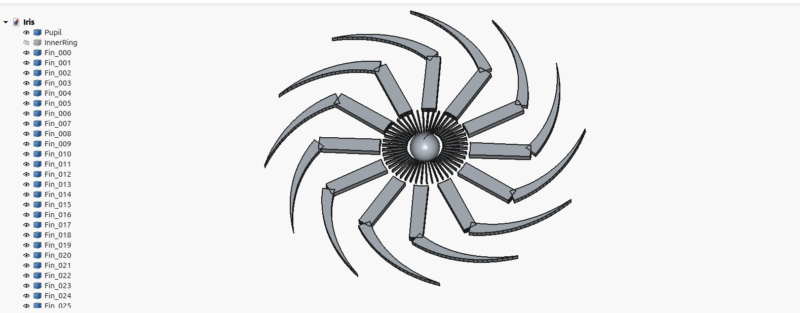

[[https://www.youtube.com/watch?v=Virp_HdWRfU][The Album]]

[[https://github.com/pramatias/freecad-experiments/tree/main/iris][code]]

* A7 Vehicle
Photo of a random old car
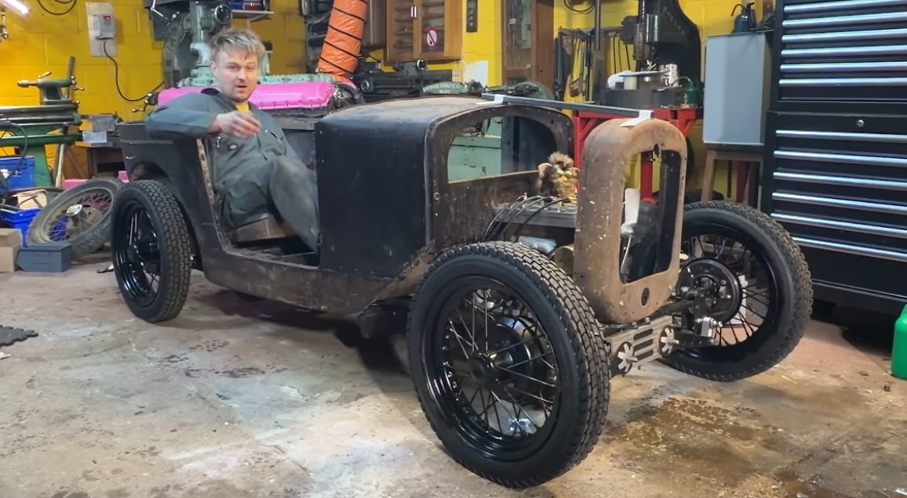

Top view
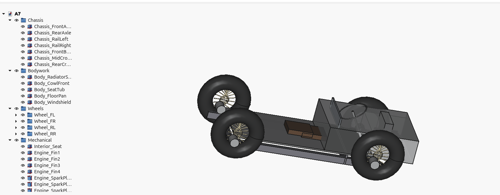

Ground View
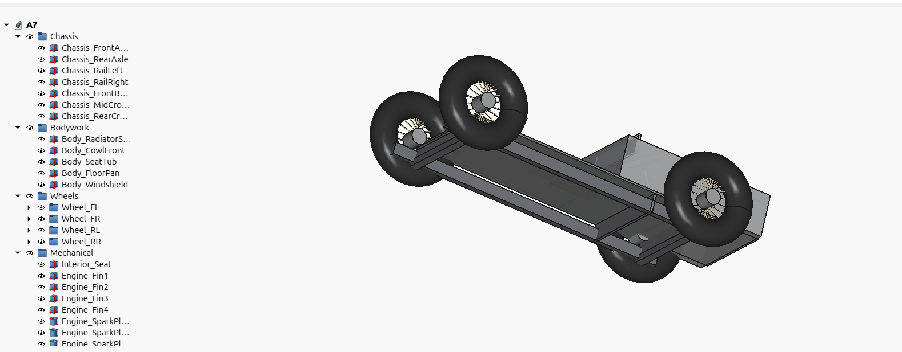

[[https://www.youtube.com/watch?v=_VHI-6KcDZQ][Random old car]]

[[https://github.com/pramatias/freecad-experiments/tree/main/a7][code]]

* Shard
Image of a song of mine

Well, not that great
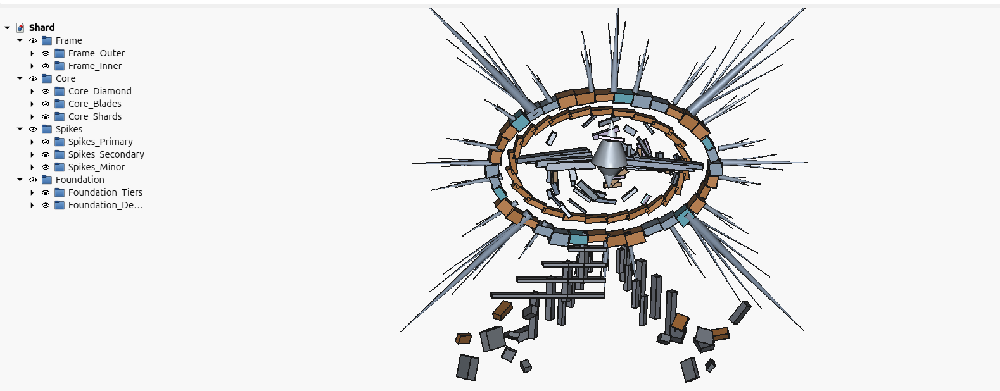

Maybe correct,
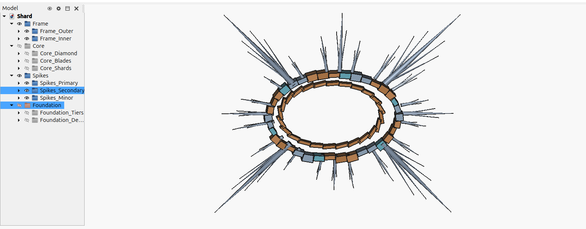

[[https://www.youtube.com/watch?v=UL1KmrHMjcM][My song]]

[[https://github.com/pramatias/freecad-experiments/tree/main/shard][code]]

* Pump
Original 3d render from Efficient Engineer, essentially 3D render duplication by just an image, and no human in the loop. I didn't touch this at all, Gemini's description transported directly into Claude, I just compiled and run the code.
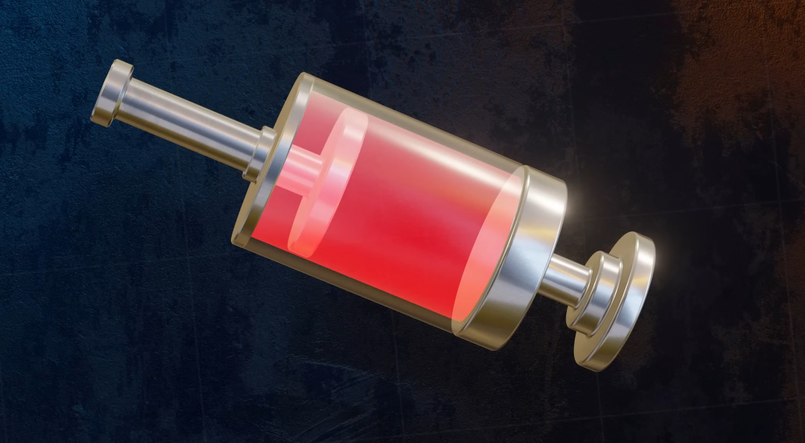

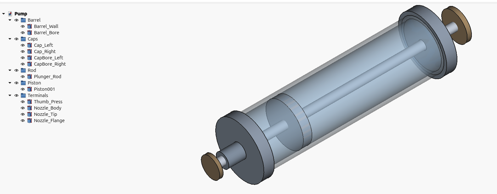

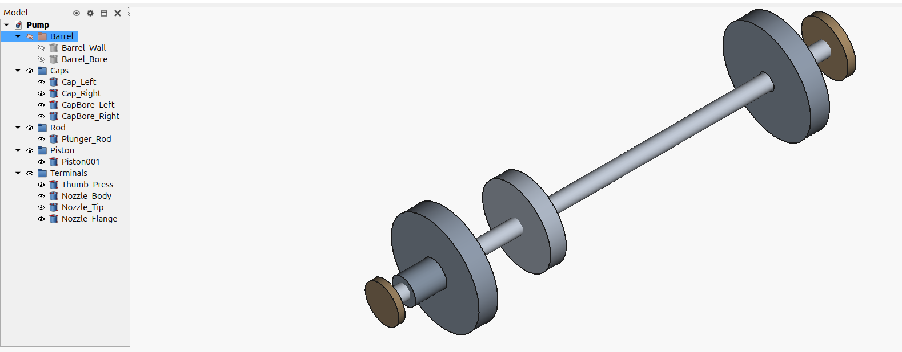

[[https://www.youtube.com/watch?v=vLaFAKnaRJU][Eficient Engineer's video]]

[[https://github.com/pramatias/freecad-experiments/tree/main/pump][code]]

If you thougth this post was interesting to you, I am available for hire. [[https://pramatias.github.io/about.html][About]]
